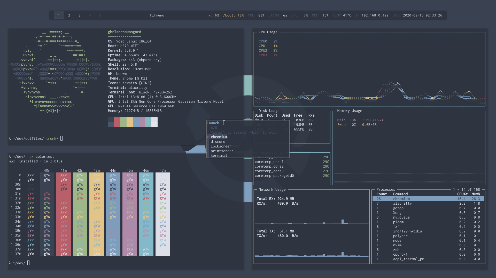

# dotfiles

## Intro
This is my dotfile repo. Here you'll find config files in order to set up [Void Linux](https://voidlinux.org/) with [bpswm](https://github.com/baskerville/bspwm) and [Nord theme](https://www.nordtheme.com/):


## Installing
This repository uses [Pilgo](https://github.com/gbrlsnchs/pilgo) to manage the installation of the configs. To install the dotfiles, install Pilgo and then run:
```console
$ plg link
```

If there are no conflicts, you're done!

Please, feel free to copy my dotfiles, since many resources were also copied from somewhere else on the internet at some point.
